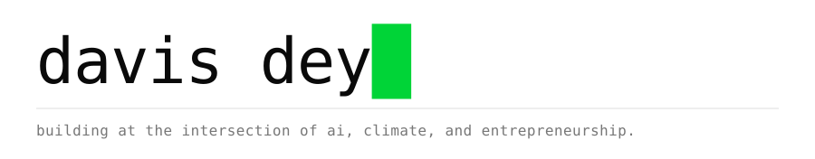

<picture>
  <source media="(prefers-color-scheme: dark)" srcset="header-dark.svg">
  
</picture>

I'm interested in understanding complex systems, building useful things from that understanding, and gradually working on harder problems.

My work spans AI-enabled products, simulation and interactive systems, and research into Ghana's emerging carbon market — particularly how its infrastructure shapes participation for local actors.

**[davissekai.github.io](https://davissekai.github.io)**

 

### `01` selected work

|  |  |  |
|:--|:--|:--|
| **VentureQuest** | A climate entrepreneurship simulation where players build and grow a venture through the decisions founders actually face. | [live&nbsp;→](https://mvp-six-vert.vercel.app/) |
| **Carbon Markets for SMEs** | How AI, better MRV infrastructure, and product design could make carbon-market participation more accessible to smaller businesses in Ghana and, eventually, across Africa. | <code>in&nbsp;development</code> |
| **Atmo** | An AI climate and sustainability assistant built to make complex climate knowledge easier to interrogate, understand, and use. | [live&nbsp;→](https://atmo-v2.vercel.app) [source&nbsp;→](https://github.com/davissekai/atmo-v2) |

 

### `02` questions I'm exploring

> How can local actors participate meaningfully in emerging carbon markets?

> What happens when AI becomes infrastructure rather than merely a tool?

> How do we build systems that expand what individuals and small teams are capable of doing?

> And what becomes possible when the cost of turning an idea into something real keeps falling?

 

### `03` working with

<picture>
  <source media="(prefers-color-scheme: dark)" srcset="stack-dark.svg">
  
</picture>

 
 

### `04` connect

[site](https://davissekai.github.io) · [linkedin](https://www.linkedin.com/in/davis-dey-141428201/) · [x](https://x.com/Renhuang_01) · [email](mailto:davisdey001@gmail.com)

---

<i>"The world doesn't care about your plans. It cares about what you build."</i>
